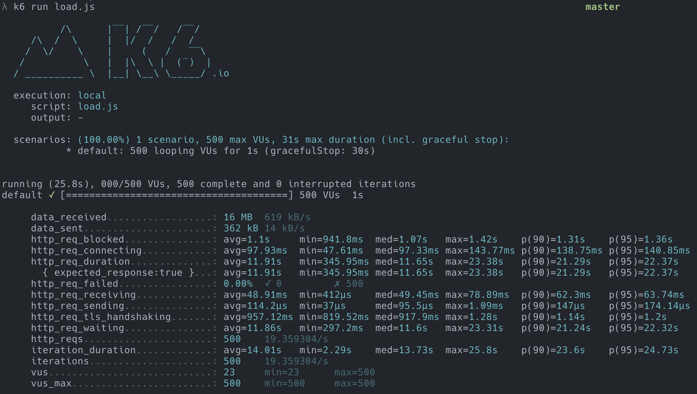

# k6-example

A bare bones basic example for load testing with [k6](https://k6.io/).

## Usage

Run the load test with

```bash
k6 run load.js
```

## Output

Sample test with running 500 `virtual users` or `vus`


